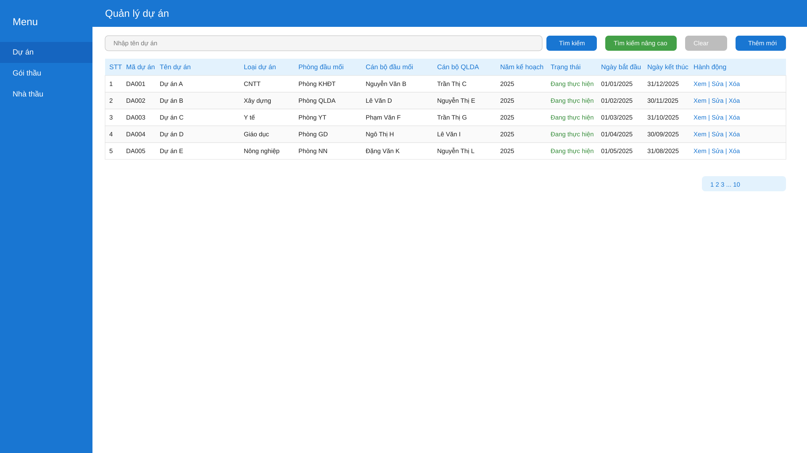
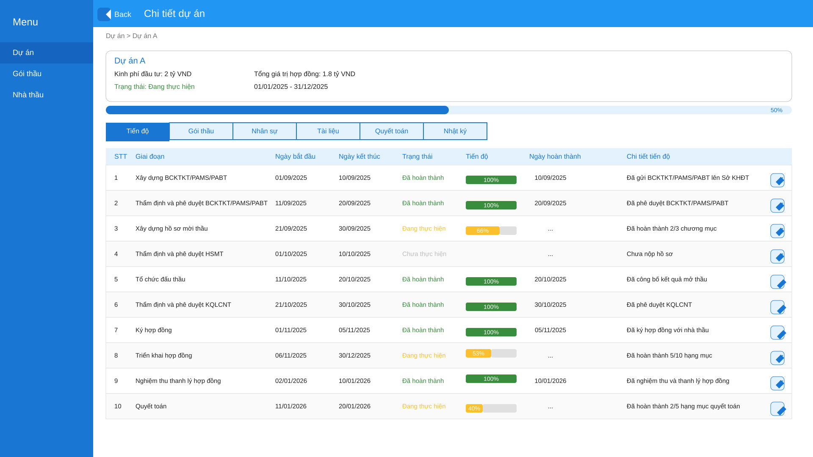
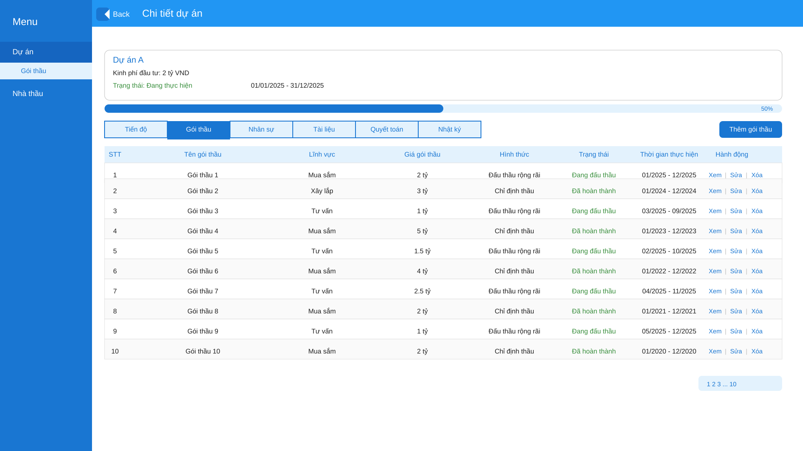

# DETAIL DESIGN HỆ THỐNG QUẢN LÝ DỰ ÁN MUA SẮM ÁP DỤNG LUẬT ĐẤU THẦU

## 1. Quản lý dự án (Project Management)
### 1.1. Mô tả nghiệp vụ
- Thêm, sửa, xóa, tìm kiếm, xem chi tiết dự án.
- Đính kèm tài liệu, theo dõi tiến độ, trạng thái.

### 1.2. Backend API
- `GET /api/projects`
- `GET /api/projects/{id}`
- `POST /api/projects`
- `PUT /api/projects/{id}`
- `DELETE /api/projects/{id}`
- `POST /api/projects/{id}/documents`
- `GET /api/projects/{id}/documents`

### 1.3. UI/UX (SVG Wireframe)
- Danh sách dự án:
  
- Form thêm/sửa dự án:
  
- Trang chi tiết dự án:
  
- Thông báo, xác nhận, responsive

---

## 2. Quản lý gói thầu (Procurement Package Management)
### 2.1. Mô tả nghiệp vụ
- Thêm, sửa, xóa, tìm kiếm, xem chi tiết gói thầu thuộc dự án.
- Quản lý thông tin, tài liệu, trạng thái, tiến độ.

### 2.2. Backend API
- `GET /api/projects/{projectId}/packages`
- `GET /api/packages/{id}`
- `POST /api/projects/{projectId}/packages`
- `PUT /api/packages/{id}`
- `DELETE /api/packages/{id}`
- `POST /api/packages/{id}/documents`
- `GET /api/packages/{id}/documents`

### 2.3. UI/UX (SVG Wireframe)
- Danh sách gói thầu:
  
- Form thêm/sửa gói thầu:
  
- Trang chi tiết: (bổ sung SVG nếu cần)

---

## 3. Quản lý nhà thầu (Bidder Management)
### 3.1. Mô tả nghiệp vụ
- Thêm, sửa, xóa, tìm kiếm, xem chi tiết nhà thầu
- Theo dõi lịch sử tham gia, trạng thái dự thầu

### 3.2. Backend API
- `GET /api/bidders`
- `GET /api/bidders/{id}`
- `POST /api/bidders`
- `PUT /api/bidders/{id}`
- `DELETE /api/bidders/{id}`

### 3.3. UI/UX
- Danh sách nhà thầu: bảng, filter, nút thêm mới
- Form thêm/sửa: nhập liệu
- Trang chi tiết: thông tin, lịch sử tham gia thầu

---

## 4. Quản lý hồ sơ mời thầu/dự thầu (Tender Document Management)
### 4.1. Mô tả nghiệp vụ
- Tạo, lưu trữ, cập nhật HSMT, HSDT cho từng gói thầu
- Theo dõi lịch sử phát hành, nhận hồ sơ, mở thầu

### 4.2. Backend API
- `POST /api/packages/{id}/tender-documents`
- `GET /api/packages/{id}/tender-documents`
- `PUT /api/tender-documents/{id}`
- `DELETE /api/tender-documents/{id}`

### 4.3. UI/UX
- Danh sách hồ sơ: bảng, filter
- Form thêm/sửa: nhập liệu, upload file

---

## 5. Quản lý hợp đồng (Contract Management)
### 5.1. Mô tả nghiệp vụ
- Thêm, sửa, xóa, tìm kiếm, xem chi tiết hợp đồng của từng gói thầu

### 5.2. Backend API
- `GET /api/packages/{id}/contracts`
- `GET /api/contracts/{id}`
- `POST /api/packages/{id}/contracts`
- `PUT /api/contracts/{id}`
- `DELETE /api/contracts/{id}`

### 5.3. UI/UX
- Danh sách hợp đồng: bảng, filter
- Form thêm/sửa: nhập liệu, upload file
- Trang chi tiết: thông tin, tiến độ, lịch sử thanh toán

---

## 6. Quản lý tài liệu (Document Management)
### 6.1. Mô tả nghiệp vụ
- Lưu trữ, phân loại, tìm kiếm tài liệu theo dự án, gói thầu, hợp đồng, từng giai đoạn

### 6.2. Backend API
- `POST /api/documents/upload`
- `GET /api/documents?projectId=&packageId=&contractId=&type=`
- `DELETE /api/documents/{id}`

### 6.3. UI/UX
- Danh sách tài liệu: bảng, filter
- Upload tài liệu: chọn file, loại, liên kết đối tượng

---

## 7. Báo cáo, thống kê (Reporting & Analytics)
### 7.1. Mô tả nghiệp vụ
- Báo cáo tiến độ, kết quả lựa chọn nhà thầu, tổng hợp chi phí, giá trị hợp đồng, thanh toán

### 7.2. Backend API
- `GET /api/reports/progress`
- `GET /api/reports/bidding-results`
- `GET /api/reports/contract-values`
- `GET /api/reports/payment-summary`
- `GET /api/reports/bidder-history`

### 7.3. UI/UX
- Trang báo cáo: chọn loại, filter, bảng, biểu đồ, xuất Excel/PDF

---

## 8. Quản lý người dùng, phân quyền (User & Permission Management)
### 8.1. Mô tả nghiệp vụ
- Quản lý tài khoản, vai trò, phân quyền truy cập

### 8.2. Backend API
- `GET /api/users`
- `GET /api/users/{id}`
- `POST /api/users`
- `PUT /api/users/{id}`
- `DELETE /api/users/{id}`
- `GET /api/roles`
- `POST /api/roles`
- `PUT /api/roles/{id}`
- `DELETE /api/roles/{id}`

### 8.3. UI/UX
- Danh sách người dùng: bảng, filter
- Form thêm/sửa: nhập liệu
- Quản lý vai trò, phân quyền: bảng, gán quyền

---

## 9. Thông báo, gửi mail (Notification & Email)
### 9.1. Mô tả nghiệp vụ
- Gửi email tự động khi có sự kiện quan trọng

### 9.2. Backend API
- `POST /api/notifications/send`
- `GET /api/notifications?userId=`

### 9.3. UI/UX
- Danh sách thông báo: bảng, filter
- Cấu hình email: form cấu hình SMTP, test gửi mail

---

## 10. Nhật ký hoạt động (Audit Log)
### 10.1. Mô tả nghiệp vụ
- Ghi nhận lịch sử thao tác của người dùng

### 10.2. Backend API
- `GET /api/audit-logs?userId=&actionType=&dateFrom=&dateTo=`

### 10.3. UI/UX
- Danh sách nhật ký: bảng, filter

---

## 11. Luồng tổng thể UI/UX
- Menu chính: Dự án | Gói thầu | Nhà thầu | Hồ sơ mời thầu | Hợp đồng | Tài liệu | Báo cáo | Người dùng | Thông báo | Nhật ký
- Breadcrumb, thông báo realtime, đa ngôn ngữ, đăng nhập/đăng xuất

---

*File này mô tả thiết kế chi tiết (detail design) cho từng luồng nghiệp vụ và UI/UX của hệ thống. Các wireframe UI/UX được đính kèm dưới dạng file SVG trong thư mục dự án để hỗ trợ thiết kế và phát triển frontend.*
