# Sơ đồ luồng nghiệp vụ (Mermaid) theo UI/UX

Tài liệu này tổng hợp các luồng nghiệp vụ chính của hệ thống dựa trên yêu cầu và các màn hình UI/UX trong thư mục `uiux_qlda/`. Mỗi sơ đồ bao gồm tên màn hình tham chiếu để đối chiếu với design.

Lưu ý: Các khối trong ngoặc [] là hành động/màn hình, các hình thoi <> là điều kiện/quyết định.

---

## 1) Luồng tổng thể từ Dự án → Gói thầu → Lựa chọn nhà thầu → Hợp đồng → Thanh toán → Kết thúc
Tham chiếu UI: 
- Project: `uiux_project_list.svg`, `uiux_project_form.svg`, `uiux_project_detail.svg`
- Package: `uiux_package_list.svg`, `uiux_package_form.svg`, `uiux_package_detail.svg`
- Bidding: `uiux_project_advanced_search_popup.svg` (tìm), `uiux_package_detail.svg` (tiến độ)
- Contract: `uiux_contract_edit_form.svg`, `uiux_package_contract_info.svg`
- Payment: `uiux_package_detail_payment.svg`, `uiux_package_detail_payment_paid_state.svg`, `uiux_package_payment_update_form.svg`, `uiux_package_payment_update_form_reopen.svg`

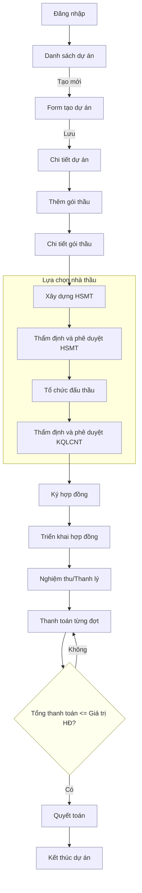
```mermaid
flowchart TD
  A[Đăng nhập] --> B[Danh sách dự án]
  B -->|Tạo mới| C[Form tạo dự án]
  C -->|Lưu| D[Chi tiết dự án]
  D --> E[Thêm gói thầu]
  E --> F[Chi tiết gói thầu]
  F --> G1

  subgraph LCNT [Lựa chọn nhà thầu]
    direction TB
    G1[Xây dựng HSMT]
    G1 --> G2[Thẩm định và phê duyệt HSMT]
    G2 --> G3[Tổ chức đấu thầu]
    G3 --> G4[Thẩm định và phê duyệt KQLCNT]
  end

  G4 --> H[Ký hợp đồng]
  H --> I[Triển khai hợp đồng]
  I --> J[Nghiệm thu/Thanh lý]
  J --> K[Thanh toán từng đợt]
  K --> L{Tổng thanh toán <= Giá trị HĐ?}
  L -- Không --> K
  L -- Có --> M[Quyết toán]
  M --> N[Kết thúc dự án]

  classDef action fill:#eef,stroke:#88a,stroke-width:1px;
  classDef decision fill:#ffe,stroke:#aa6,stroke-width:1px;
  class A,B,C,D,E,F,G1,G2,G3,G4,H,I,J,K,M,N action;
  class L decision;
```

Hình ảnh tham chiếu:
- Danh sách Dự án: 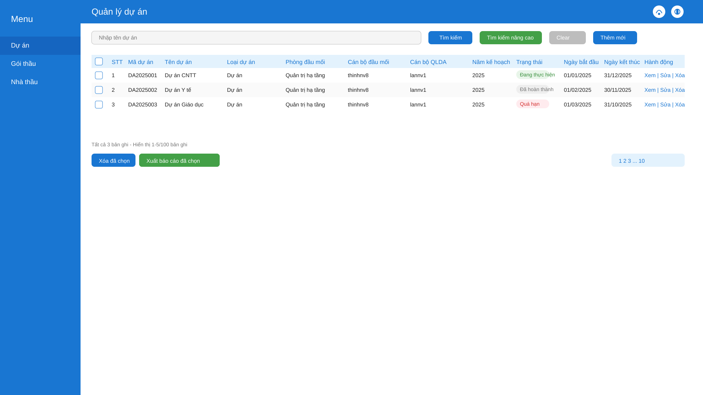
- Form Dự án: 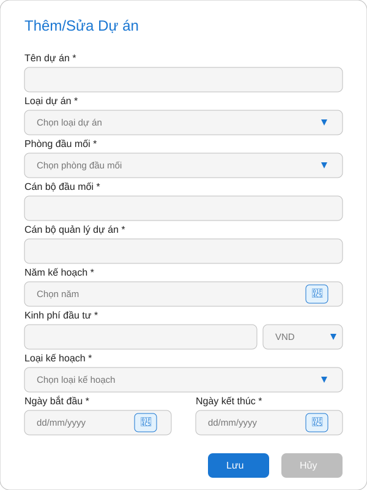
- Chi tiết Dự án: 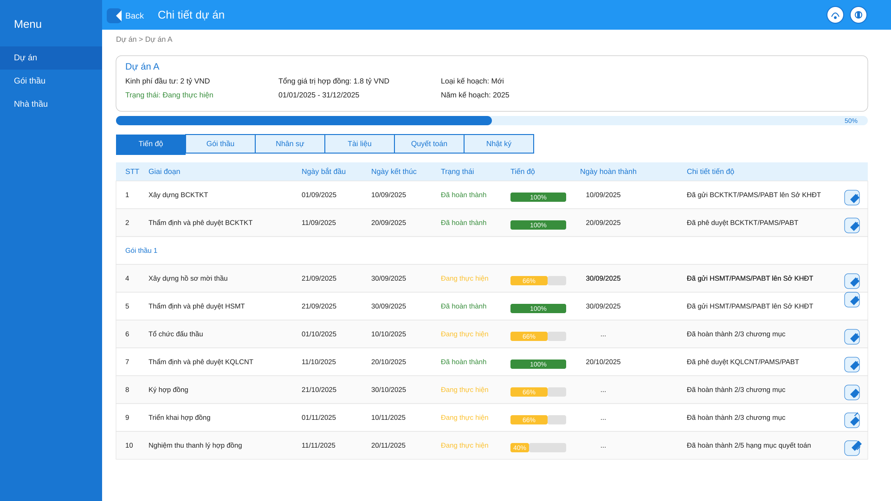
- Danh sách Gói thầu: 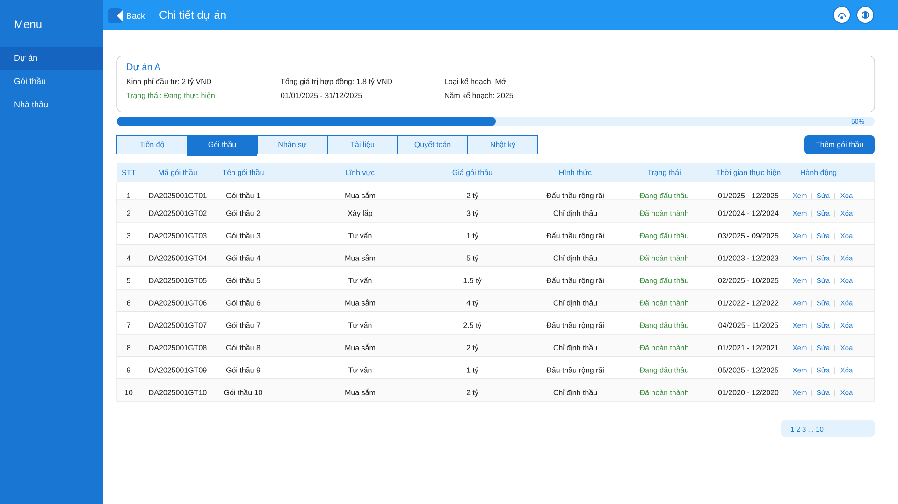
- Form Gói thầu: 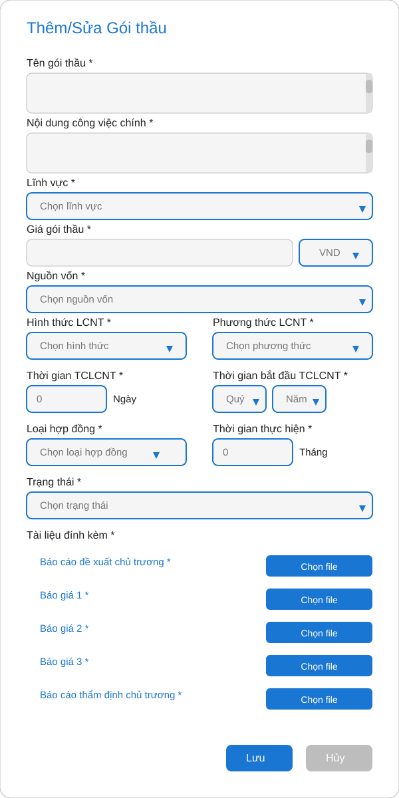
- Chi tiết Gói thầu: 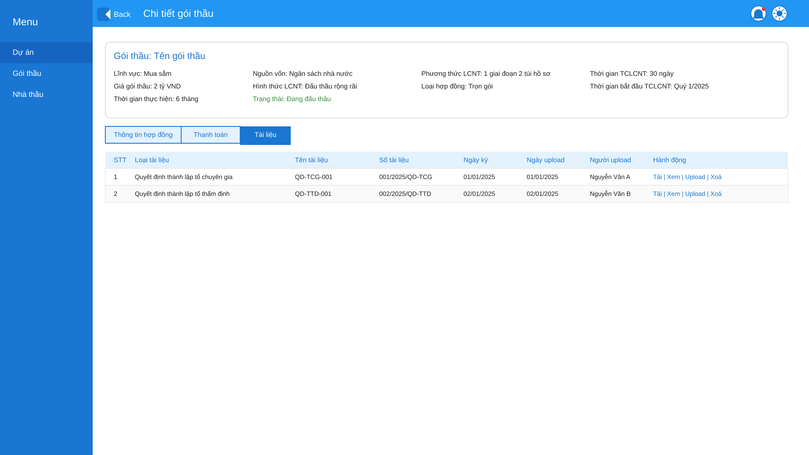

---

## 2) Quản lý dự án: danh sách, tìm kiếm nâng cao, mở chi tiết, tài liệu
Tham chiếu UI: `uiux_project_list.svg`, `uiux_project_advanced_search_popup.svg`, `uiux_project_detail.svg`, `uiux_project_document.svg`

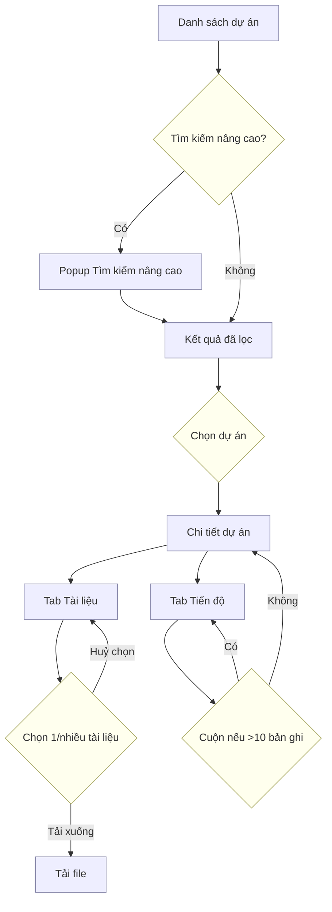
```mermaid
flowchart TD
  P1[Danh sách dự án] --> P2{Tìm kiếm nâng cao?}
  P2 -- Có --> P3[Popup Tìm kiếm nâng cao]
  P3 --> P4[Kết quả đã lọc]
  P2 -- Không --> P4
  P4 --> P5{Chọn dự án}
  P5 --> P6[Chi tiết dự án]
  P6 --> P7[Tab Tài liệu]
  P7 --> P8{Chọn 1/nhiều tài liệu}
  P8 -- Tải xuống --> P9[Tải file]
  P8 -- Huỷ chọn --> P7
  P6 --> P10[Tab Tiến độ]
  P10 --> P11{Cuộn nếu >10 bản ghi}
  P11 -- Có --> P10
  P11 -- Không --> P6

  classDef action fill:#eef,stroke:#88a;
  classDef decision fill:#ffe,stroke:#aa6;
  class P1,P3,P4,P6,P7,P9,P10 action;
  class P2,P5,P8,P11 decision;
```

Hình ảnh tham chiếu:
- Danh sách Dự án: 
- Popup Tìm kiếm nâng cao: 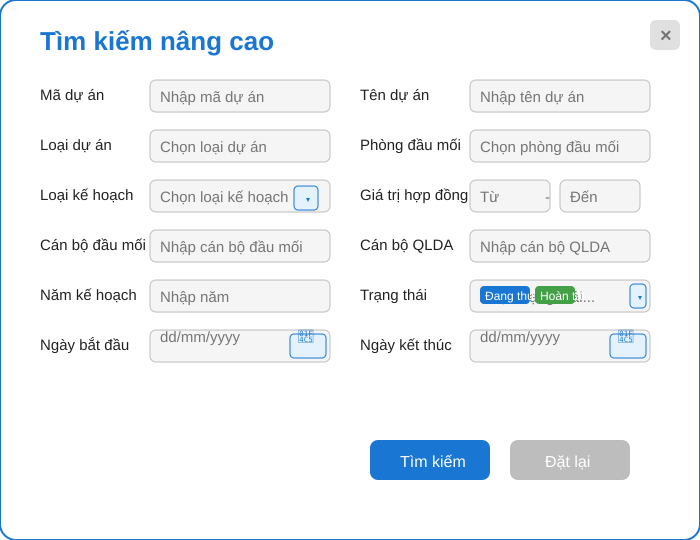
- Chi tiết Dự án: 
- Tab Tài liệu Dự án: 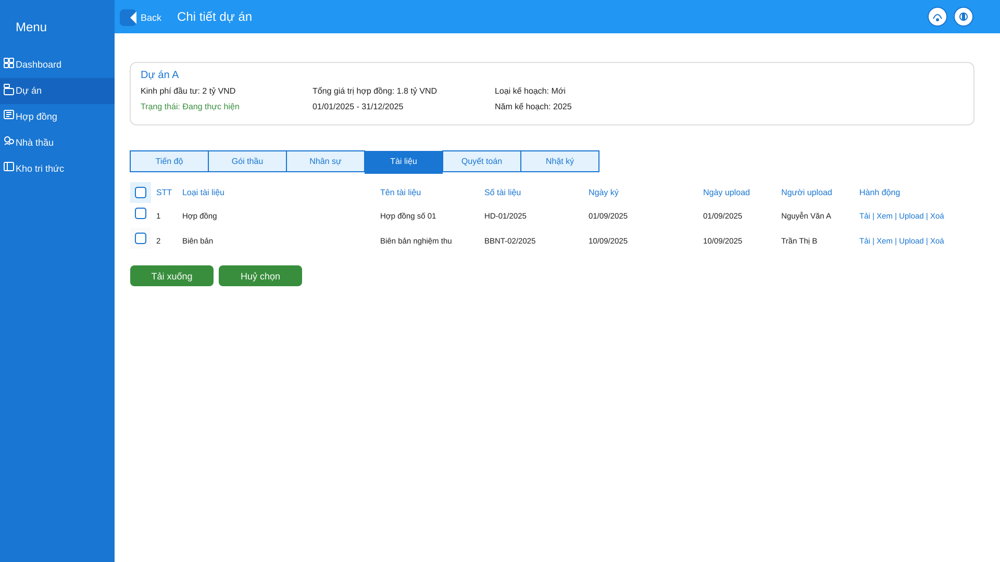

---

## 3) Logic giai đoạn (state) theo loại dự án
Tham chiếu UI: `uiux_project_detail.svg`, `uiux_package_detail.svg`

### 3.1 Dự án (DA)
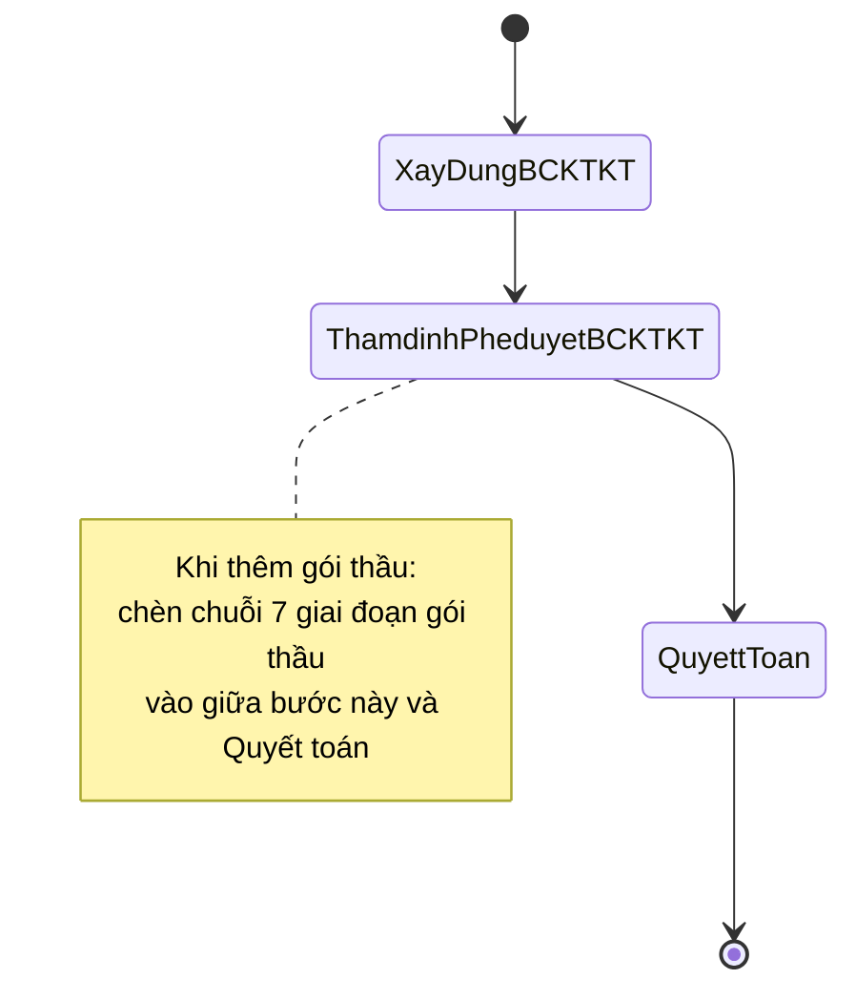
```mermaid
stateDiagram-v2
  [*] --> XayDungBCKTKT
  XayDungBCKTKT --> ThamdinhPheduyetBCKTKT
  ThamdinhPheduyetBCKTKT --> QuyettToan
  note right of ThamdinhPheduyetBCKTKT
    Khi thêm gói thầu:
    chèn chuỗi 7 giai đoạn gói thầu
    vào giữa bước này và Quyết toán
  end note
  QuyettToan --> [*]
```

### 3.2 Phương án mua sắm hàng hoá (HH)
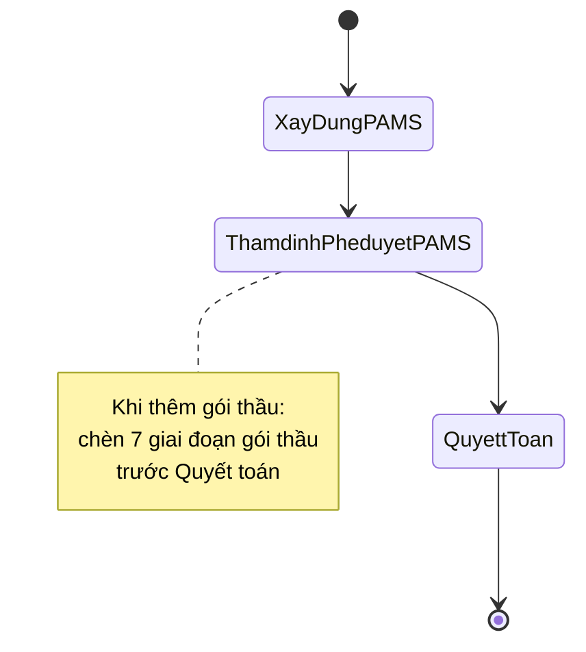
```mermaid
stateDiagram-v2
  [*] --> XayDungPAMS
  XayDungPAMS --> ThamdinhPheduyetPAMS
  ThamdinhPheduyetPAMS --> QuyettToan
  note right of ThamdinhPheduyetPAMS
    Khi thêm gói thầu:
    chèn 7 giai đoạn gói thầu
    trước Quyết toán
  end note
  QuyettToan --> [*]
```

### 3.3 Phương án mua sắm dịch vụ (DV)
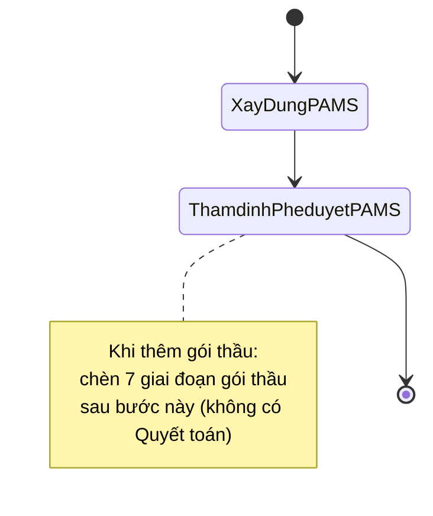
```mermaid
stateDiagram-v2
  [*] --> XayDungPAMS
  XayDungPAMS --> ThamdinhPheduyetPAMS
  note right of ThamdinhPheduyetPAMS
    Khi thêm gói thầu:
    chèn 7 giai đoạn gói thầu
    sau bước này (không có Quyết toán)
  end note
  ThamdinhPheduyetPAMS --> [*]
```

### 3.4 Phương án bảo trì (BT)
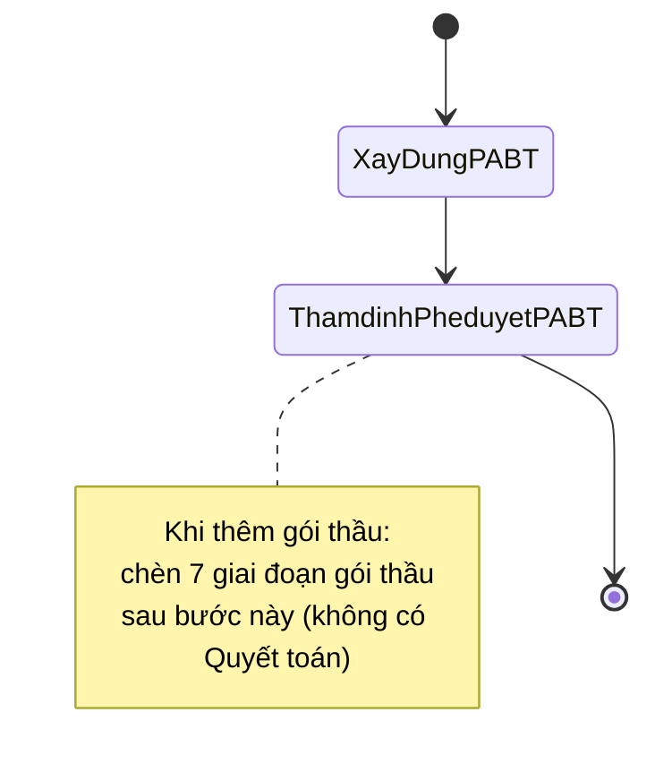
```mermaid
stateDiagram-v2
  [*] --> XayDungPABT
  XayDungPABT --> ThamdinhPheduyetPABT
  note right of ThamdinhPheduyetPABT
    Khi thêm gói thầu:
    chèn 7 giai đoạn gói thầu
    sau bước này (không có Quyết toán)
  end note
  ThamdinhPheduyetPABT --> [*]
```

### 3.5 7 giai đoạn chèn khi có Gói thầu
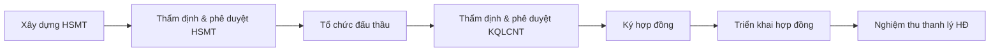
```mermaid
flowchart LR
  A1[Xây dựng HSMT] --> A2[Thẩm định & phê duyệt HSMT]
  A2 --> A3[Tổ chức đấu thầu]
  A3 --> A4[Thẩm định & phê duyệt KQLCNT]
  A4 --> A5[Ký hợp đồng]
  A5 --> A6[Triển khai hợp đồng]
  A6 --> A7[Nghiệm thu thanh lý HĐ]
```

---

## 4) Quy trình lựa chọn nhà thầu (Bidding Process)
Tham chiếu UI: `uiux_package_detail.svg`, `uiux_package_detail_documents.svg`

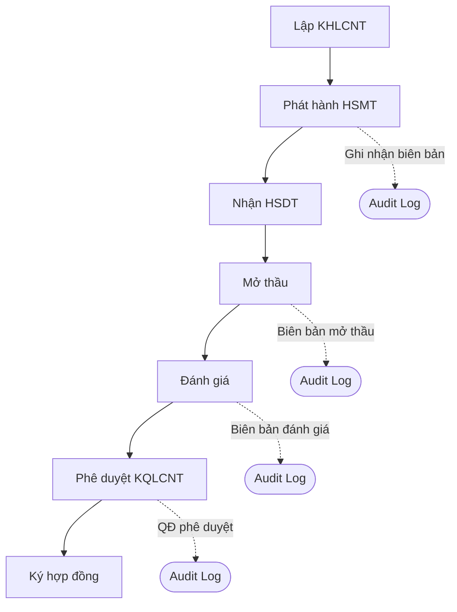
```mermaid
flowchart TD
  B1[Lập KHLCNT] --> B2[Phát hành HSMT]
  B2 --> B3[Nhận HSDT]
  B3 --> B4[Mở thầu]
  B4 --> B5[Đánh giá]
  B5 --> B6[Phê duyệt KQLCNT]
  B6 --> B7[Ký hợp đồng]

  B2 -. Ghi nhận biên bản .-> Log1([Audit Log])
  B4 -. Biên bản mở thầu .-> Log2([Audit Log])
  B5 -. Biên bản đánh giá .-> Log3([Audit Log])
  B6 -. QĐ phê duyệt .-> Log4([Audit Log])

  classDef action fill:#eef,stroke:#88a;
```

Hình ảnh tham chiếu:
- Tài liệu gói thầu: 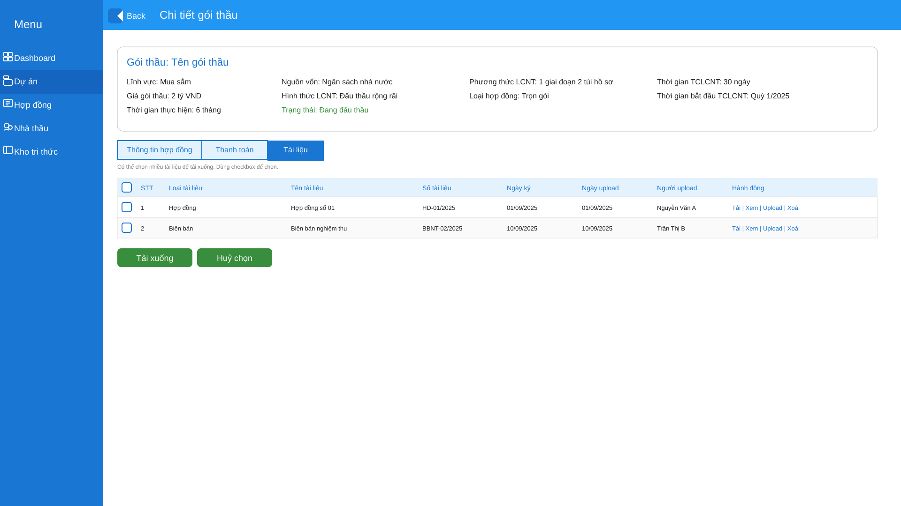

---

## 5) Thanh toán hợp đồng theo đợt và cập nhật trạng thái
Tham chiếu UI: `uiux_package_detail_payment.svg`, `uiux_package_detail_payment_paid_state.svg`, `uiux_package_payment_update_form.svg`, `uiux_package_payment_update_form_reopen.svg`

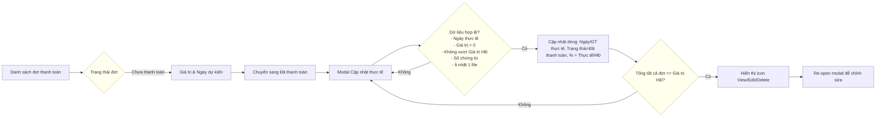
```mermaid
flowchart LR
  C1[Danh sách đợt thanh toán] --> C2{Trạng thái đợt}
  C2 -- Chưa thanh toán --> C3[Giá trị & Ngày dự kiến]
  C3 --> C4[Chuyển sang Đã thanh toán]
  C4 --> C5[Modal Cập nhật thực tế]
  C5 --> C6{Dữ liệu hợp lệ?<br/>- Ngày thực tế<br/>- Giá trị > 0<br/>- Không vượt Giá trị HĐ<br/>- Số chứng từ<br/>- Ít nhất 1 file}
  C6 -- Không --> C5
  C6 -- Có --> C7[Cập nhật dòng: Ngày/GT thực tế, Trạng thái=Đã thanh toán, % = Thực tế/HĐ]
  C7 --> C8{Tổng tất cả đợt <= Giá trị HĐ?}
  C8 -- Không --> C5
  C8 -- Có --> C9[Hiển thị icon View/Edit/Delete]
  C9 --> C10[Re-open modal để chỉnh sửa]

  classDef action fill:#eef,stroke:#88a;
  classDef decision fill:#ffe,stroke:#aa6;
  class C1,C3,C4,C5,C7,C9,C10 action;
  class C2,C6,C8 decision;
```

Lưu ý thao tác theo UI
- "Thêm đợt": tự động thêm 1 bản ghi mới với số đợt tăng dần.
- "Sinh theo số đợt": tự động sinh các đợt theo số đợt thanh toán đã khai báo ở tab Thông tin hợp đồng.

Hình ảnh tham chiếu:
- Tab Thanh toán: 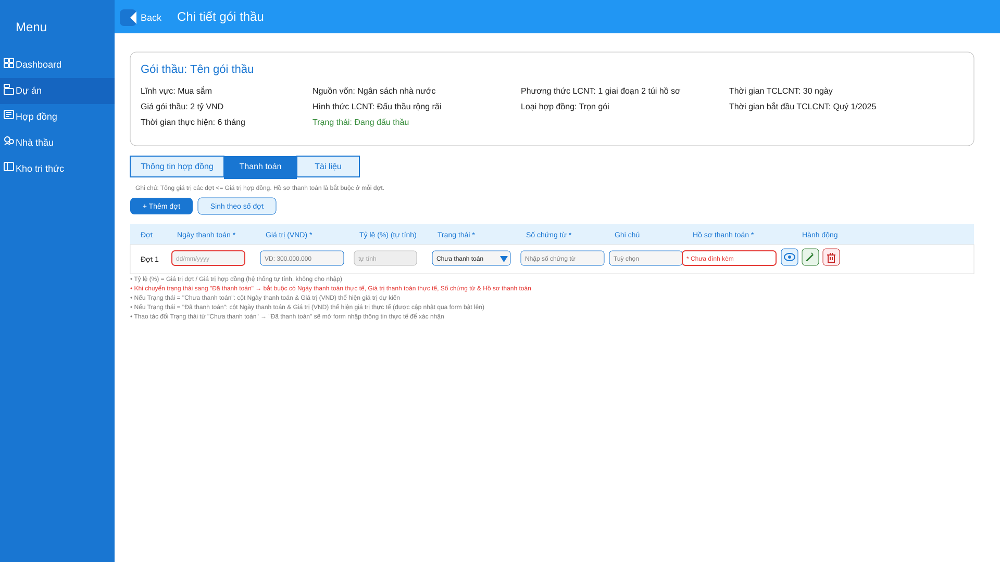
- Modal cập nhật thực tế: 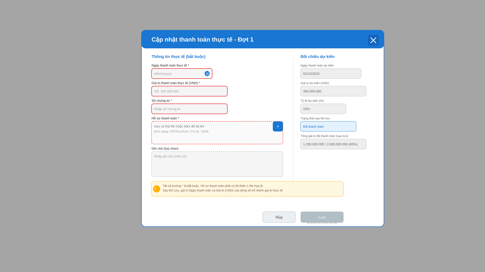
- Modal re-open chỉnh sửa: 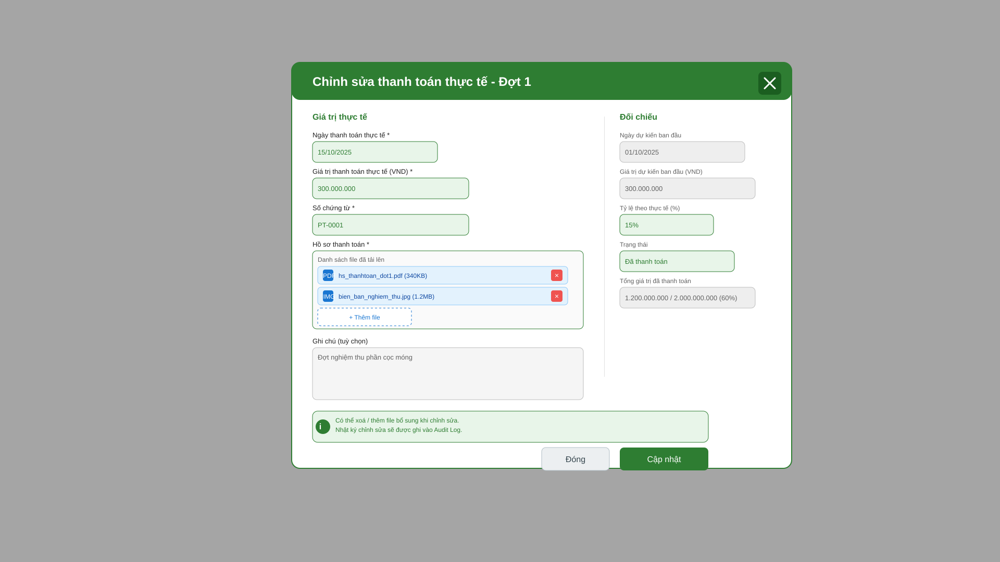
- Trạng thái hàng đã thanh toán: 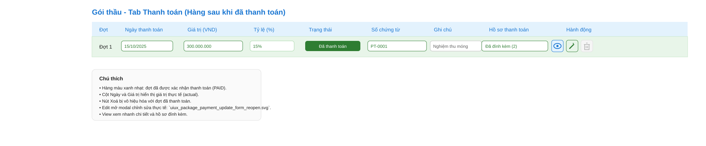

---

## 6) Quản lý tài liệu/Knowledge Base
Tham chiếu UI: `uiux_knowledge_base.svg`, `uiux_knowledge_base_add_document.svg`, `uiux_project_document.svg`, `uiux_package_detail_documents.svg`

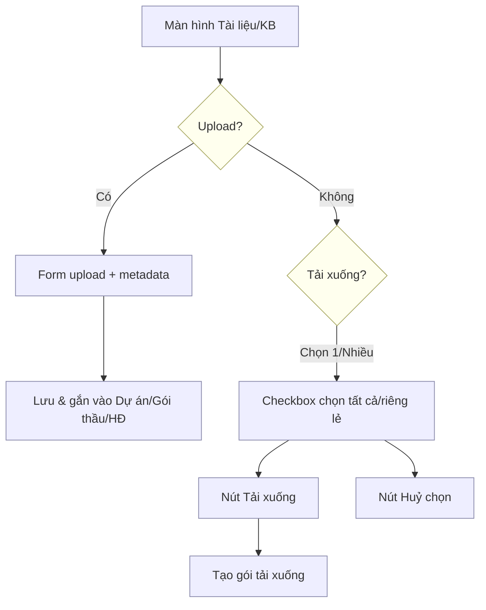
```mermaid
flowchart TD
  D1[Màn hình Tài liệu/KB] --> D2{Upload?}
  D2 -- Có --> D3[Form upload + metadata]
  D3 --> D4[Lưu & gắn vào Dự án/Gói thầu/HĐ]
  D2 -- Không --> D5
  D5{Tải xuống?} -- Chọn 1/Nhiều --> D6[Checkbox chọn tất cả/riêng lẻ]
  D6 --> D7[Nút Tải xuống]
  D7 --> D8[Tạo gói tải xuống]
  D6 --> D9[Nút Huỷ chọn]

  classDef action fill:#eef,stroke:#88a;
  classDef decision fill:#ffe,stroke:#aa6;
  class D1,D3,D4,D6,D7,D8,D9 action;
  class D2,D5 decision;
```

Hình ảnh tham chiếu:
- Kho tri thức: 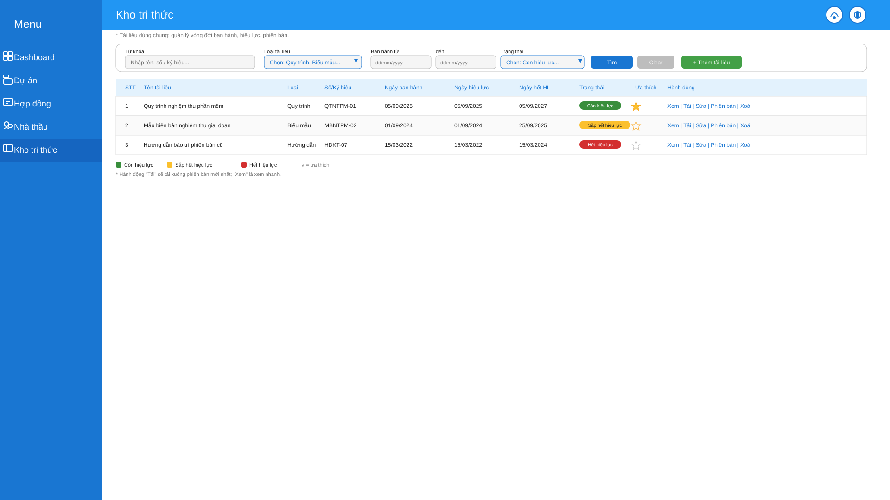
- Popup thêm tài liệu: 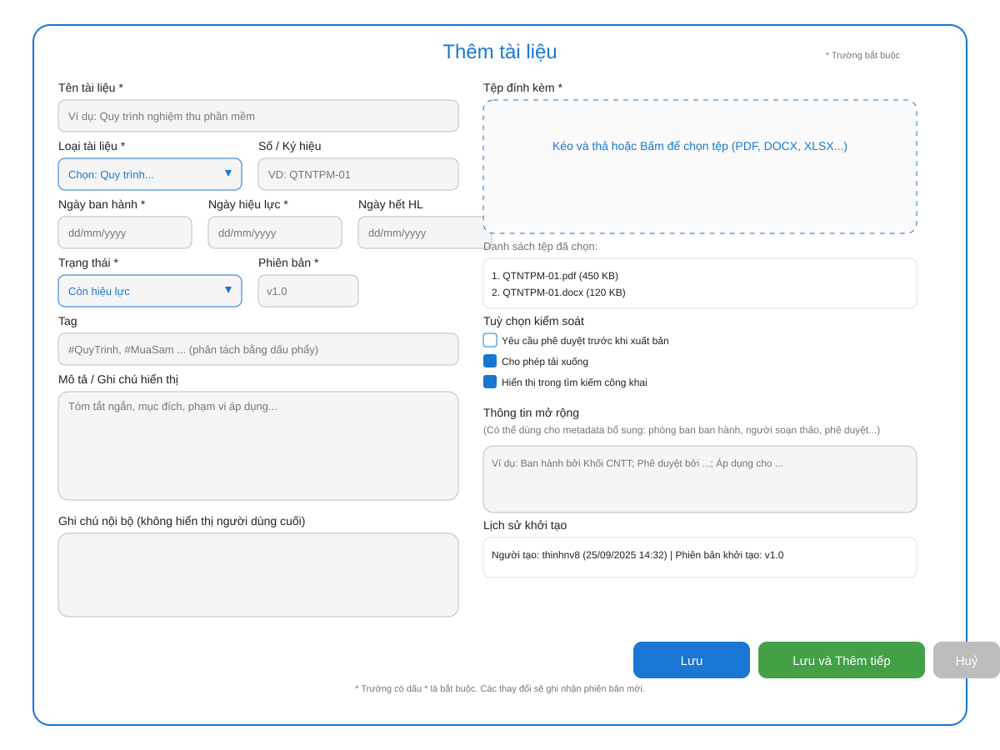
- Tài liệu Dự án: 
- Tài liệu Gói thầu: 

---

## 7) Quản lý Nhà thầu
Tham chiếu UI: `uiux_contractor_list.svg`, `uiux_contractor_add.svg`, `uiux_contractor_detail_popup.svg`

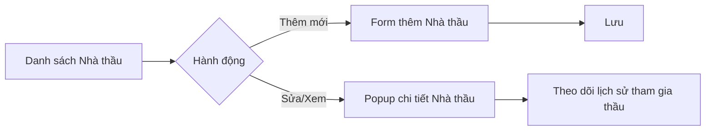
```mermaid
flowchart LR
  N1[Danh sách Nhà thầu] --> N2{Hành động}
  N2 -- Thêm mới --> N3[Form thêm Nhà thầu]
  N3 --> N4[Lưu]
  N2 -- Sửa/Xem --> N5[Popup chi tiết Nhà thầu]
  N5 --> N6[Theo dõi lịch sử tham gia thầu]
```

Hình ảnh tham chiếu:
- Danh sách Nhà thầu: 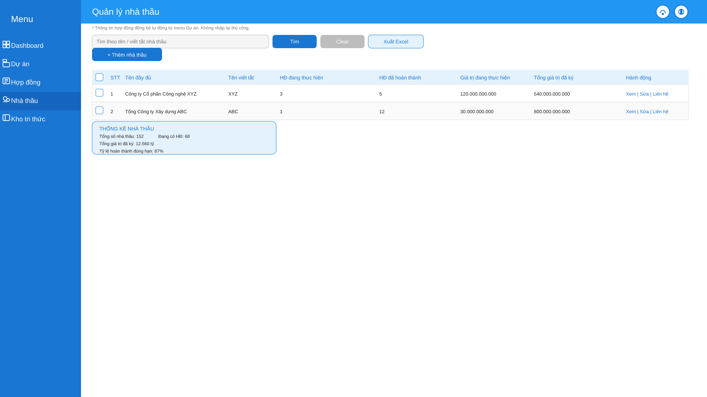
- Popup thêm Nhà thầu: 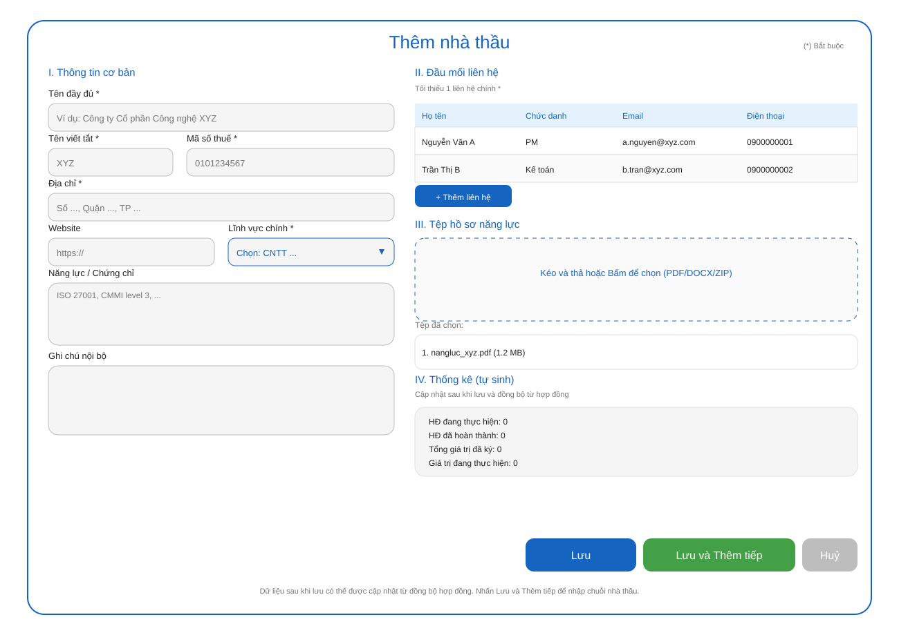
- Popup chi tiết Nhà thầu: 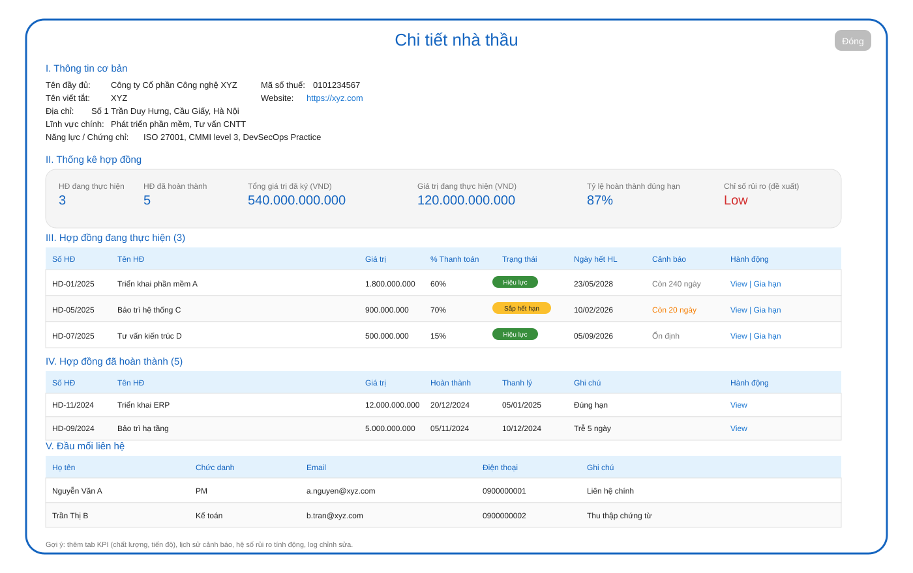

---

## 8) Báo cáo & Xuất dữ liệu
Tham chiếu UI: `uiux_project_list.svg`

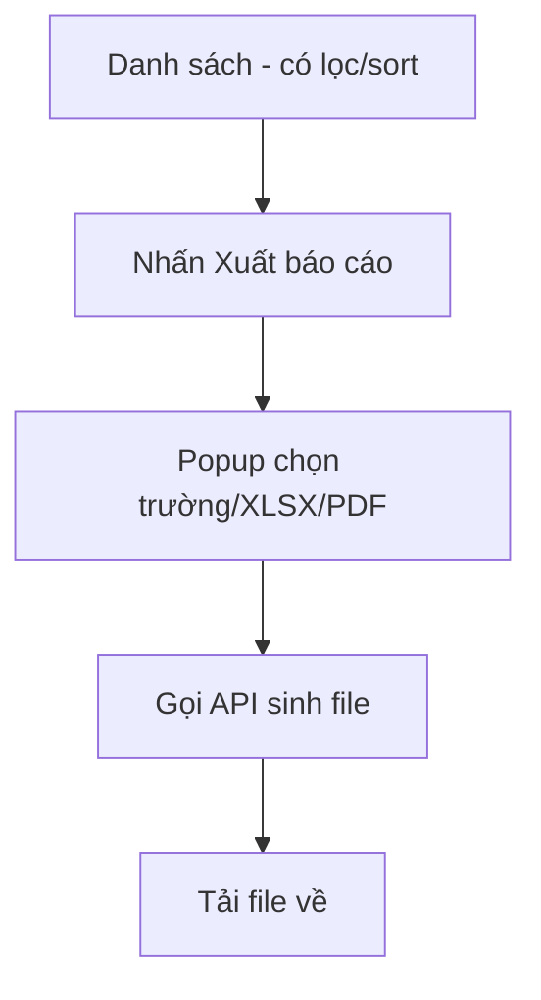
```mermaid
flowchart TD
  R1[Danh sách - có lọc/sort] --> R2[Nhấn Xuất báo cáo]
  R2 --> R3[Popup chọn trường/XLSX/PDF]
  R3 --> R4[Gọi API sinh file]
  R4 --> R5[Tải file về]
```

Hình ảnh tham chiếu:
- Danh sách Dự án (nút Xuất báo cáo): 

---

## 9) Đăng nhập, phân quyền, nhật ký & thông báo
Tham chiếu UI: `uiux_dashboard.svg`

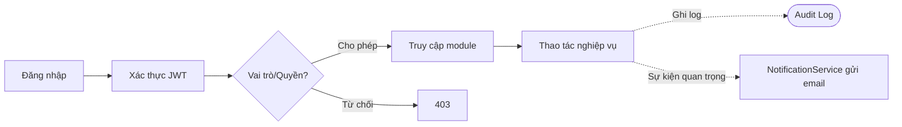
```mermaid
flowchart LR
  U1[Đăng nhập] --> U2[Xác thực JWT]
  U2 --> U3{Vai trò/Quyền?}
  U3 -- Cho phép --> U4[Truy cập module]
  U3 -- Từ chối --> U5[403]
  U4 --> U6[Thao tác nghiệp vụ]
  U6 -. Ghi log .-> U7([Audit Log])
  U6 -. Sự kiện quan trọng .-> U8[NotificationService gửi email]
```

Hình ảnh tham chiếu:
- Dashboard: 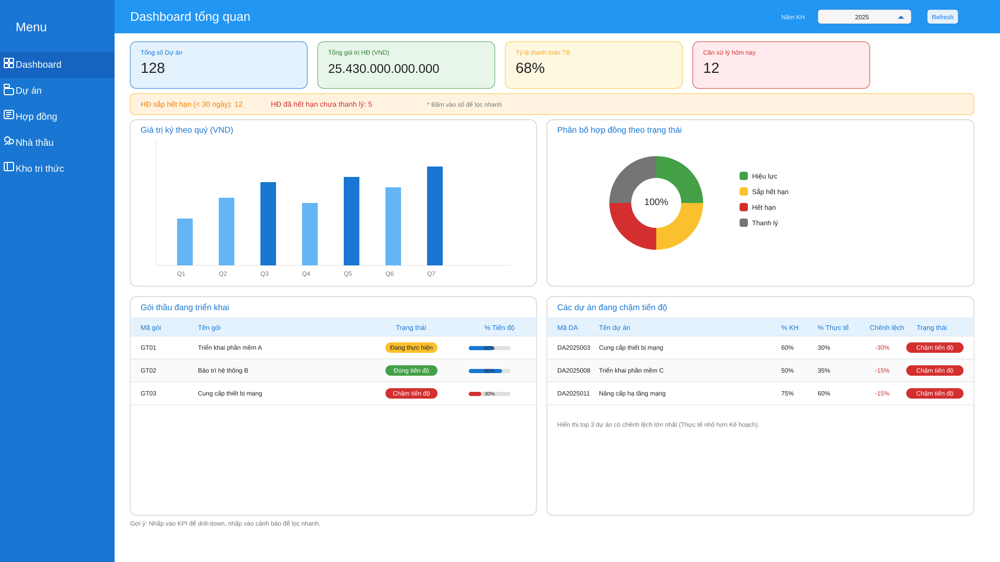

---

## 10) Bản đồ màn hình → luồng (tham chiếu nhanh)
- Dự án: Danh sách → Form → Chi tiết/Tab Tiến độ/Tab Tài liệu
- Gói thầu: Danh sách → Form → Chi tiết/Tab Tiến độ/Tab Tài liệu
- Lựa chọn nhà thầu: Xây dựng HSMT → Thẩm định & phê duyệt HSMT → Tổ chức đấu thầu → Thẩm định & phê duyệt KQLCNT
- Hợp đồng & Thanh toán: Ký → Triển khai → Các đợt thanh toán (Chưa/Đã thanh toán) → Quyết toán → Kết thúc
- Tài liệu/KB: Upload → Gắn → Tải xuống (multi-select)
- Nhà thầu: Thêm/Sửa/Xem → Theo dõi tham gia
- Báo cáo: Lọc → Xuất XLSX/PDF
- Bảo mật: Đăng nhập (JWT) → Phân quyền → Audit Log → Email

---

## 11) Luồng menu Hợp đồng (Contract Menu)
Tham chiếu UI: `uiux_contract_list.svg`, `uiux_package_contract_info.svg`

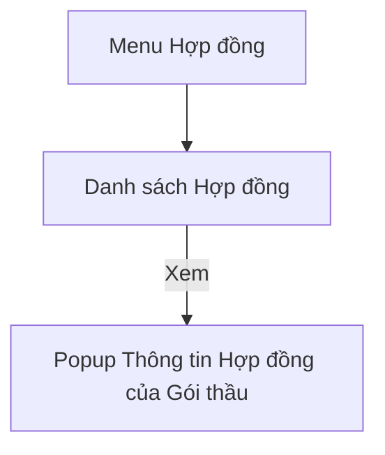
```mermaid
flowchart TD
  C11[Menu Hợp đồng] --> C12[Danh sách Hợp đồng]
  C12 -->|Xem| C13[Popup Thông tin Hợp đồng của Gói thầu]
```

Hình ảnh tham chiếu:
- Danh sách Hợp đồng: 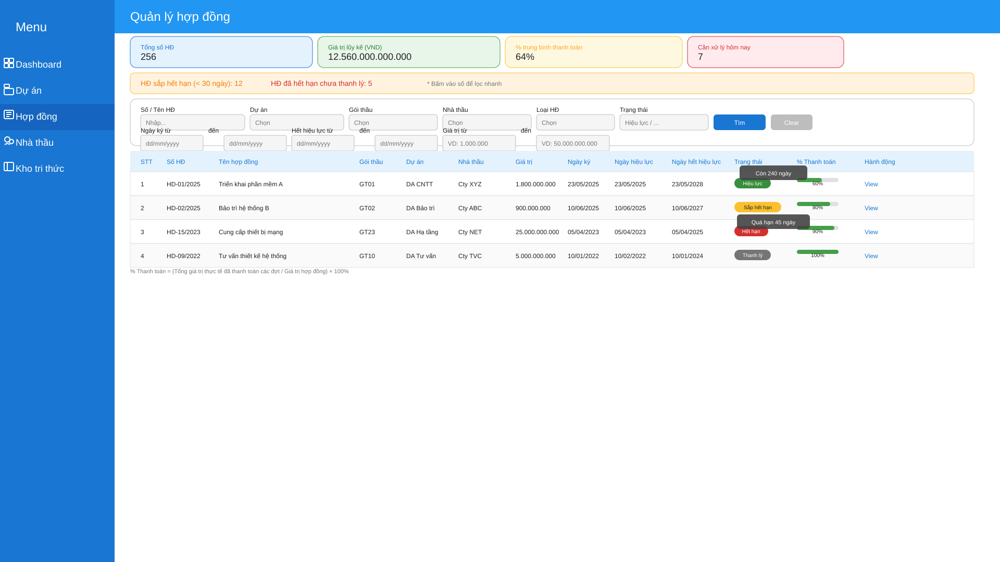
- Popup Thông tin Hợp đồng: 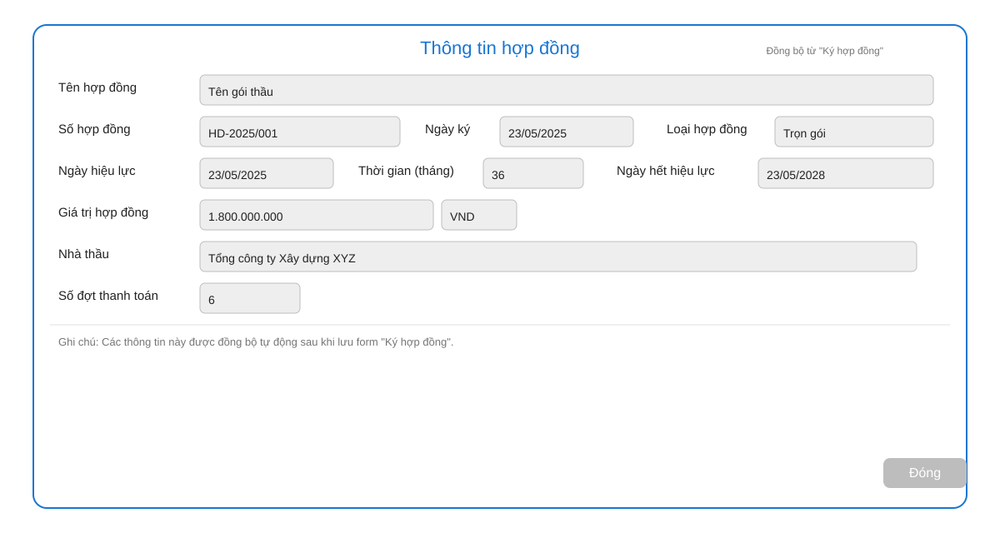

---

## 12) Luồng menu Dashboard
Tham chiếu UI: `uiux_dashboard.svg`

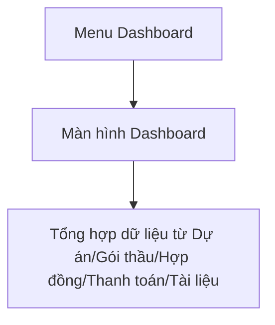
```mermaid
flowchart TD
  Dsh1[Menu Dashboard] --> Dsh2[Màn hình Dashboard]
  Dsh2 --> Dsh3[Tổng hợp dữ liệu từ Dự án/Gói thầu/Hợp đồng/Thanh toán/Tài liệu]
```

Hình ảnh tham chiếu:
- Màn hình Dashboard: 
