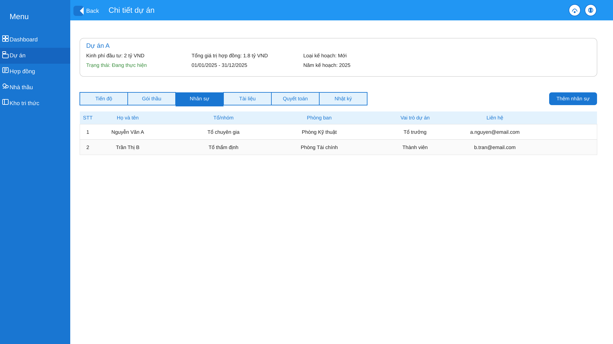
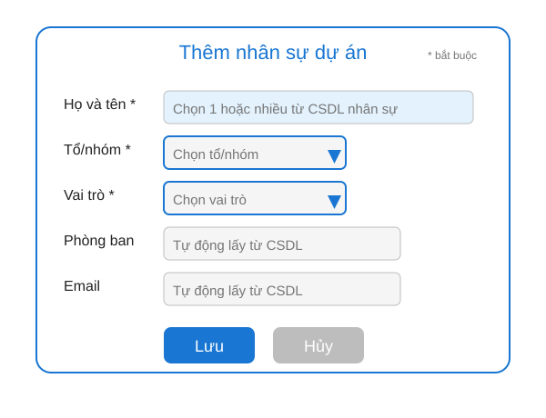
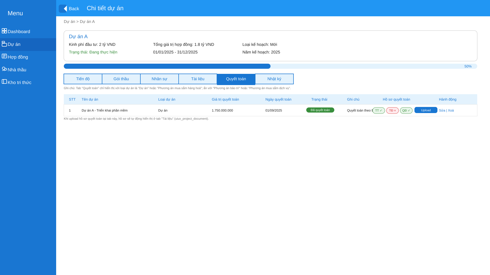
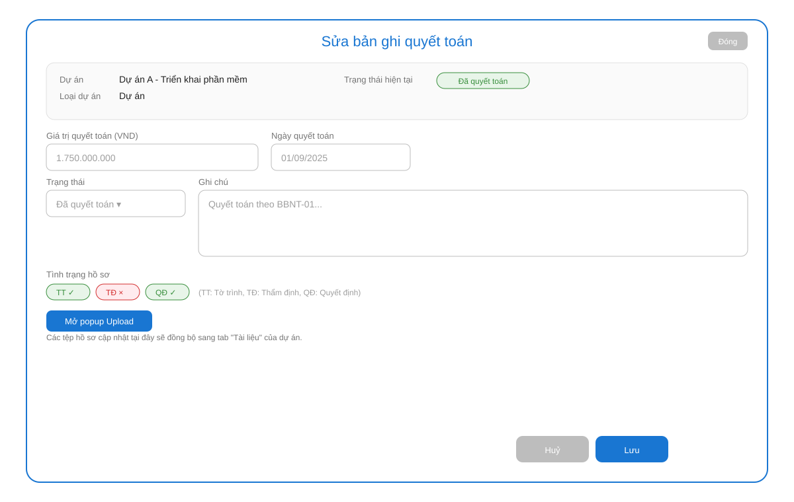
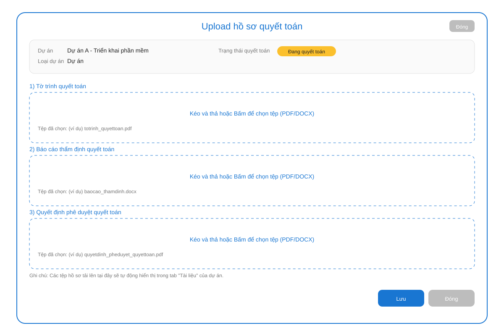

# DETAIL DESIGN HỆ THỐNG QUẢN LÝ DỰ ÁN MUA SẮM ÁP DỤNG LUẬT ĐẤU THẦU

## 1. Quản lý dự án (Project Management)
### 1.1. Mô tả nghiệp vụ
- Thêm, sửa, xóa, tìm kiếm, xem chi tiết dự án.
- Đính kèm tài liệu, theo dõi tiến độ, trạng thái.

### 1.2. Backend API
- `GET /api/projects`
- `GET /api/projects/{id}`
- `POST /api/projects`
- `PUT /api/projects/{id}`
- `DELETE /api/projects/{id}`
- `POST /api/projects/{id}/documents`
- `GET /api/projects/{id}/documents`

### 1.3. UI/UX (SVG Wireframe)
- Danh sách dự án:
  
- Form thêm/sửa dự án:
  
- Popup tìm kiếm nâng cao:
  
- Trang chi tiết dự án (mặc định tab "Tiến độ"):
  
  - **Bổ sung:**
    - Hiển thị trường "Loại kế hoạch" (Mới/Bổ sung/Chuyển tiếp) bên phải "Tổng giá trị hợp đồng".
    - Hiển thị trường "Năm kế hoạch" bên phải dải ngày "01/01/2025 - 31/12/2025".
    - Khi số lượng bản ghi tiến độ vượt quá 10, cho phép scroll để xem tiếp.
  - Tab "Gói thầu" → danh sách gói thầu của dự án:
    
    - "Thêm gói thầu" → popup:
      
    - Hành động "Xem" → chi tiết gói thầu (mặc định tab "Thông tin hợp đồng"):
      
      - Tab "Thanh toán":
        
        - "Thêm đợt": tự động thêm 1 dòng mới với số đợt tăng dần.
        - "Sinh theo số đợt": sinh các đợt theo số đợt đã khai báo ở tab Thông tin hợp đồng.
        - "Chỉnh sửa" lần đầu → popup:
          
        - "Chỉnh sửa" từ lần 2 → popup:
          
        - Trạng thái sau khi đã thanh toán:
          
      - Tab "Tài liệu":
        
  - Tab "Nhân sự":
    
    - "Thêm nhân sự" → popup:
      
  - Tab "Tài liệu":
    
  - Tab "Quyết toán":
    
    - "Sửa" → popup:
      
    - "Upload" → popup:
      

---

## 2. Quản lý gói thầu (Procurement Package Management)
### 2.1. Mô tả nghiệp vụ
- Thêm, sửa, xóa, tìm kiếm, xem chi tiết gói thầu thuộc dự án.
- Quản lý thông tin, tài liệu, trạng thái, tiến độ.

### 2.2. Backend API
- `GET /api/projects/{projectId}/packages`
- `GET /api/packages/{id}`
- `POST /api/projects/{projectId}/packages`
- `PUT /api/packages/{id}`
- `DELETE /api/packages/{id}`
- `POST /api/packages/{id}/documents`
- `GET /api/packages/{id}/documents`

### 2.3. UI/UX (SVG Wireframe)
- Danh sách gói thầu:
  
- Form thêm/sửa gói thầu:
  
- Chi tiết gói thầu (mặc định tab "Thông tin hợp đồng"):
  
  - Tab "Thanh toán": 
  - Tab "Tài liệu": 

---

## 3. Quản lý nhà thầu (Bidder Management)
### 3.1. Mô tả nghiệp vụ
- Thêm, sửa, xóa, tìm kiếm, xem chi tiết nhà thầu
- Theo dõi lịch sử tham gia, trạng thái dự thầu

### 3.2. Backend API
- `GET /api/bidders`
- `GET /api/bidders/{id}`
- `POST /api/bidders`
- `PUT /api/bidders/{id}`
- `DELETE /api/bidders/{id}`

### 3.3. UI/UX
- Danh sách nhà thầu:
  
- Thêm nhà thầu (popup):
  
- Popup chi tiết nhà thầu:
  

---

---

## 5. Quản lý hợp đồng (Contract Management)
### 5.1. Mô tả nghiệp vụ
- Thêm, sửa, xóa, tìm kiếm, xem chi tiết hợp đồng của từng gói thầu

### 5.2. Backend API
- `GET /api/packages/{id}/contracts`
- `GET /api/contracts/{id}`
- `POST /api/packages/{id}/contracts`
- `PUT /api/contracts/{id}`
- `DELETE /api/contracts/{id}`

### 5.3. UI/UX
- Danh sách hợp đồng (menu Hợp đồng):
  
  - Hành động "Xem" → popup:
    
- Trang chi tiết gói thầu (tab Thông tin hợp đồng): hiển thị readonly mapping từ contract API.
- Form cập nhật hợp đồng & tiến độ cho giai đoạn "Ký hợp đồng" (SVG: `uiux_qlda/menu_project/uiux_contract_edit_form.svg`)
  - Hiển thị khi người dùng nhấn nút "Chỉnh sửa" tại giai đoạn "Ký hợp đồng" trong tab Tiến độ của project_detail.
  - Trường bắt buộc: Tên hợp đồng (mặc định theo tên gói thầu), Số hợp đồng, Ngày ký, Ngày hiệu lực, Thời gian thực hiện (tháng), Giá trị + đơn vị, Nhà thầu, Số đợt thanh toán.
  - Trường tự động: Ngày hết hiệu lực = Ngày hiệu lực + Thời gian thực hiện; Loại hợp đồng readonly.
  - Nhóm Tiến độ: dropdown Trạng thái và các ràng buộc nhập ngày như đã mô tả.

### 5.4. Đồng bộ dữ liệu thật (Tab "Thông tin hợp đồng" của gói thầu)
- API khuyến nghị:
  - GET `GET /api/packages/{id}/contract`
  - POST/PUT `POST /api/packages/{id}/contract` | `PUT /api/contracts/{id}`
- JSON mẫu (response GET /api/packages/{id}/contract):
```json
{
  "packageId": "PKG-001",
  "name": "Tên gói thầu",
  "number": "HD-2025/001",
  "signedDate": "2025-05-23",
  "effectiveDate": "2025-05-23",
  "durationMonths": 36,
  "expireDate": "2028-05-23",
  "value": 1800000000,
  "currency": "VND",
  "bidderId": "NT-XYZ",
  "bidderName": "Tổng công ty Xây dựng XYZ",
  "type": "Trọn gói",
  "paymentInstallments": 6
}
```
- Mapping hiển thị: các trường readonly như phần HLD.

### 5.5. Quy tắc định dạng & xử lý hiển thị
- Định dạng ngày, tiền tệ, wrap tên dài (không ellipsis) như phần HLD.

### 5.6. Tab "Thanh toán" của gói thầu
- Quản lý đợt thanh toán theo số đợt đã khai báo, phân biệt planned vs actual như đã mô tả.
- Modal xác nhận thực tế lần đầu: `../uiux_qlda/menu_project/uiux_package_payment_update_form.svg`.
- Modal re-open chỉnh sửa: `../uiux_qlda/menu_project/uiux_package_payment_update_form_reopen.svg`.
- Trạng thái hàng sau khi thanh toán: `../uiux_qlda/menu_project/uiux_package_detail_payment_paid_state.svg`.

#### 5.6.1. Phân tách dữ liệu dự kiến & thực tế (Model đề xuất)
| Trường | Mô tả |
|--------|-------|
| plannedPayDate | Ngày dự kiến thanh toán ban đầu |
| plannedAmount | Giá trị dự kiến thanh toán |
| actualPayDate | Ngày thanh toán thực tế (null nếu chưa) |
| actualAmount | Giá trị thanh toán thực tế (null nếu chưa) |
| status | PENDING hoặc PAID |
| voucherNo | Bắt buộc khi PAID |
| attachments | Danh sách file đính kèm (>=1 khi PAID) |
| note | Ghi chú tuỳ chọn |

Hiển thị bảng:
- Cột Ngày thanh toán = (status==PAID ? actualPayDate : plannedPayDate)
- Cột Giá trị (VND) = (status==PAID ? actualAmount : plannedAmount)
- Cột Tỷ lệ (%) = (status==PAID ? actualAmount : plannedAmount) / contract.value * 100 (round 2)

#### 5.6.2. Flow chuyển trạng thái
1. User đổi dropdown trạng thái dòng từ PENDING → PAID.
2. Frontend chặn thay đổi trực tiếp, bật modal `uiux_package_payment_update_form.svg`.
3. Nhập đủ 4 trường bắt buộc, validate tổng không vượt Giá trị HĐ.
4. PUT /api/payments/{id} kèm trường actual*, server set status=PAID.
5. Thành công → cập nhật lại bảng, style xanh, hiển thị đính kèm.
6. Re-open Edit → mở `uiux_package_payment_update_form_reopen.svg` (prefill actual data).

#### 5.6.3. Delete / Edit ràng buộc
- Không cho xoá đợt PAID; sửa PAID tùy chính sách; sửa PENDING tự do planned*.

#### 5.6.4. Icon Hành động
- View | Edit | Delete với confirm trước khi xoá (PENDING).

### 5.8. Frontend - Helpers (Cập nhật)
- computeDisplayDate, computeDisplayAmount, computeRatio như phần HLD.
- Tách validation planned vs actual, disable Submit nếu thiếu trường bắt buộc.

### 5.9. Backend - Payments API (Model & validation)
- Model, validation, error codes và endpoint mở rộng như phần HLD.

### 5.10. Tài liệu - Enum & mapping API
- Thêm type `PAYMENT_SUPPORT` khi upload hồ sơ thanh toán.

### 5.11. Audit Log cho thanh toán
- CREATE_PAYMENT, UPDATE_PAYMENT_PLANNED_FIELDS, CONFIRM_PAYMENT_ACTUAL, ADJUST_PAYMENT_ACTUAL, ADD/REMOVE_ATTACHMENT.

---

## 6. Quản lý tài liệu (Document Management)
### 6.1. Mô tả nghiệp vụ
- Lưu trữ, phân loại, tìm kiếm tài liệu theo dự án, gói thầu, hợp đồng, từng giai đoạn
- Cho phép tải xuống tất cả tài liệu hoặc chọn 1 hoặc nhiều tài liệu để tải về:
  - Checkbox chọn tất cả và từng dòng; nút "Tải xuống" và "Huỷ chọn" nằm dưới cùng bên trái bảng.

### 6.2. Backend API
- `POST /api/documents/upload`
- `GET /api/documents?projectId=&packageId=&contractId=&type=`
- `DELETE /api/documents/{id}`
- `POST /api/documents/download`

### 6.3. UI/UX
- Màn hình Kho tri thức:
  
- Popup thêm tài liệu:
  
- Trang Tài liệu của dự án:
  
- Trang Tài liệu của gói thầu:
  

---

## 7. Báo cáo, thống kê (Reporting & Analytics)
### 7.1. Mô tả nghiệp vụ
- Báo cáo tiến độ, kết quả lựa chọn nhà thầu, tổng hợp chi phí, giá trị hợp đồng, thanh toán

### 7.2. Backend API
- `GET /api/reports/progress`
- `GET /api/reports/bidding-results`
- `GET /api/reports/contract-values`
- `GET /api/reports/payment-summary`
- `GET /api/reports/bidder-history`

### 7.3. UI/UX
- Trang báo cáo: chọn loại, filter, bảng, biểu đồ, xuất Excel/PDF

---

## 8. Quản lý người dùng, phân quyền (User & Permission Management)
### 8.1. Mô tả nghiệp vụ
- Quản lý tài khoản, vai trò, phân quyền truy cập

### 8.2. Backend API
- `GET /api/users`
- `GET /api/users/{id}`
- `POST /api/users`
- `PUT /api/users/{id}`
- `DELETE /api/users/{id}`
- `GET /api/roles`
- `POST /api/roles`
- `PUT /api/roles/{id}`
- `DELETE /api/roles/{id}`

### 8.3. UI/UX
- Danh sách người dùng: bảng, filter
- Form thêm/sửa: nhập liệu
- Quản lý vai trò, phân quyền: bảng, gán quyền

---

## 9. Thông báo, gửi mail (Notification & Email)
### 9.1. Mô tả nghiệp vụ
- Gửi email tự động khi có sự kiện quan trọng

### 9.2. Backend API
- `POST /api/notifications/send`
- `GET /api/notifications?userId=`

### 9.3. UI/UX
- Danh sách thông báo: bảng, filter
- Cấu hình email: form cấu hình SMTP, test gửi mail

---

## 10. Nhật ký hoạt động (Audit Log)
### 10.1. Mô tả nghiệp vụ
- Ghi nhận lịch sử thao tác của người dùng

### 10.2. Backend API
- `GET /api/audit-logs?userId=&actionType=&dateFrom=&dateTo=`

### 10.3. UI/UX
- Danh sách nhật ký: bảng, filter

---

## 11. Dashboard
- Màn hình Dashboard tổng hợp:
  
- Dữ liệu lấy từ các module liên quan: dự án, gói thầu, hợp đồng, thanh toán, tài liệu…

---

# Bổ sung các chức năng UI/UX cho màn hình project_list

## 1. Tìm kiếm nâng cao (Advanced Search)
- Nút "Tìm kiếm nâng cao" mở popup tìm kiếm nâng cao.
- Popup cho phép lọc theo: Loại dự án, Phòng đầu mối, Năm kế hoạch, Trạng thái, Cán bộ đầu mối, Cán bộ QLDA, Ngày bắt đầu, Ngày kết thúc.

## 2. Hiển thị tổng số bản ghi và số bản ghi đang xem
- Thêm dòng thông tin: “Hiển thị 1-10/100 bản ghi” phía trên hoặc dưới bảng.

## 3. Chức năng sắp xếp (Sort)
- Click vào tiêu đề cột để sắp xếp tăng/giảm.

## 4. Chức năng lọc nhanh (Quick Filter)
- Thêm dropdown nhanh cho Loại dự án, Trạng thái, Năm kế hoạch.

## 5. Chức năng chọn nhiều bản ghi (Multi-select)
- Checkbox đầu dòng và đầu bảng; thao tác hàng loạt (Xóa, Xuất báo cáo).

## 6. Trạng thái hiển thị rõ ràng hơn
- Badge màu cho trạng thái (xanh, xám, đỏ).

## 7. Chức năng xuất báo cáo nâng cao
- Popup chọn trường xuất Excel; thêm xuất PDF.

## 8. Click tên dự án mở chi tiết
- Tên dự án là link mở màn hình chi tiết dự án.

---

## 6. Quy tắc nghiệp vụ tiến độ/giai đoạn theo loại dự án

### 6.1. Các loại dự án và logic giai đoạn tiến độ
- Dự án, Phương án HH, Phương án DV, Phương án BT: như mô tả ở HLD, chèn 7 giai đoạn gói thầu khi thêm gói thầu.

### 6.2. Quy tắc giao diện
- Nếu nhiều gói thầu, tab Tiến độ có scrollbar để xem hết.
