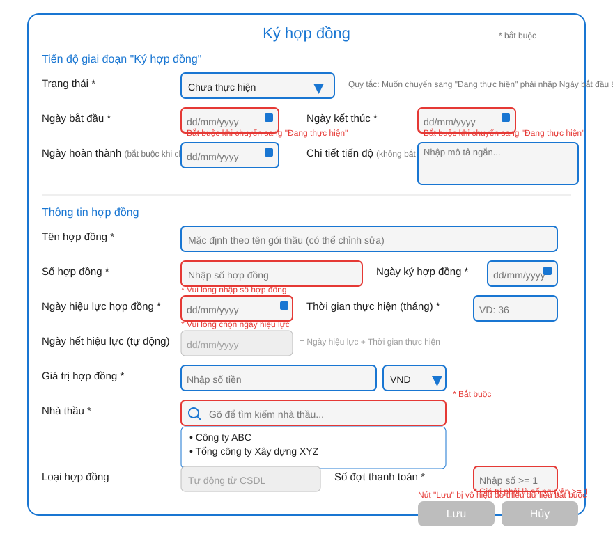

# YÊU CẦU NGHIỆP VỤ PHẦN MỀM QUẢN LÝ DỰ ÁN MUA SẮM ÁP DỤNG LUẬT ĐẤU THẦU VIỆT NAM
Luồng chức năng theo menu (UI/UX chốt theo SVG)

Mục tiêu: Chuẩn hoá yêu cầu nghiệp vụ theo các luồng người dùng thực tế trên giao diện đã chốt. Mỗi luồng bên dưới tham chiếu trực tiếp tới các file SVG thiết kế trong thư mục `uiux_qlda/`.

### 15.1. Menu Dự án
- Danh sách dự án: hiển thị theo bố cục và cột đúng như SVG.
  - Màn hình: `uiux_project_list.svg`
  - Ảnh tham chiếu: 
- Thêm mới dự án: nhấn "Thêm mới" mở popup form.
  - Popup: `uiux_project_form.svg`
  - Ảnh tham chiếu: 
- Tìm kiếm nâng cao: nhấn "Tìm kiếm nâng cao" mở popup.
  - Popup: `uiux_project_advanced_search_popup.svg`
  - Ảnh tham chiếu: 
- Xem chi tiết dự án: click hành động "Xem" hoặc tên dự án.
  - Mặc định mở tab "Tiến độ". Ở mỗi bản ghi giai đoạn có nút "Chỉnh sửa" mở popup chỉnh sửa.
  - Riêng giai đoạn "Ký hợp đồng": nhấn "Chỉnh sửa" mở popup `uiux_contract_edit_form.svg`.
  - Màn hình chi tiết: 
  - Popup hợp đồng: 
- Tab "Gói thầu": mở danh sách gói thầu thuộc dự án.
  - Màn hình: `uiux_package_list.svg` → 
  - "Thêm gói thầu": mở `uiux_package_form.svg` → 
  - Hành động "Xem": mở `uiux_package_detail.svg` (mặc định tab "Thông tin hợp đồng").
    - 
    - Tab "Thanh toán": `uiux_package_detail_payment.svg` → 
      - "Thêm đợt": tự động thêm 1 bản ghi mới với số đợt tăng dần.
      - "Sinh theo số đợt": tự động sinh các đợt theo số đợt thanh toán khai báo ở tab Thông tin hợp đồng.
      - "Chỉnh sửa" lần đầu: mở `uiux_package_payment_update_form.svg` → 
      - "Chỉnh sửa" từ lần 2: mở `uiux_package_payment_update_form_reopen.svg` → 
      - Trạng thái sau khi đã thanh toán: thể hiện như `uiux_package_detail_payment_paid_state.svg` → 
    - Tab "Tài liệu": `uiux_package_detail_documents.svg` → 
- Tab "Nhân sự": `uiux_project_personnel.svg` → 
  - "Thêm nhân sự": `uiux_add_personnel_form.svg` → 
- Tab "Tài liệu": `uiux_project_document.svg` → 
- Tab "Quyết toán": `uiux_project_settlement.svg` → 
  - "Sửa": `uiux_project_settlement_edit_popup.svg` → 
  - "Upload": `uiux_project_settlement_upload_popup.svg` → 

### 15.2. Menu Hợp đồng
- Click menu Hợp đồng: hiển thị danh sách hợp đồng `uiux_contract_list.svg` → 
- Hành động "Xem": mở popup `uiux_package_contract_info.svg` → 

### 15.3. Menu Nhà thầu
- Click menu Nhà thầu: danh sách `uiux_contractor_list.svg` → 
- "Thêm nhà thầu": popup `uiux_contractor_add.svg` → 
- Hành động "Xem": popup `uiux_contractor_detail_popup.svg` → 

### 15.4. Menu Kho tri thức
- Click menu Kho tri thức: `uiux_knowledge_base.svg` → 
- "Thêm tài liệu": popup `uiux_knowledge_base_add_document.svg` → 

### 15.5. Menu Dashboard
- Click menu Dashboard: `uiux_dashboard.svg` → 
- Dữ liệu hiển thị tổng hợp từ cơ sở dữ liệu đã nhập tại các màn hình liên quan.

---

*Phần 15 đảm bảo tài liệu nghiệp vụ bám sát các tương tác UI/UX đã chốt, giúp thống nhất phạm vi và hành vi hệ thống.*
